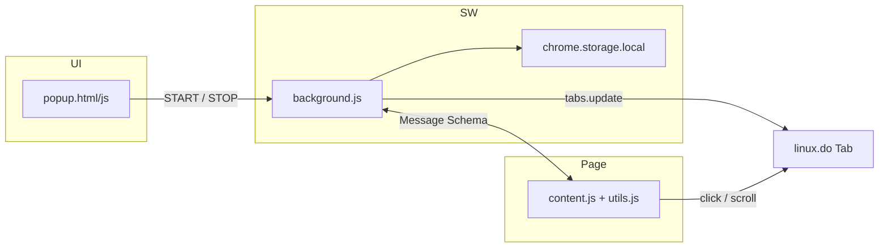
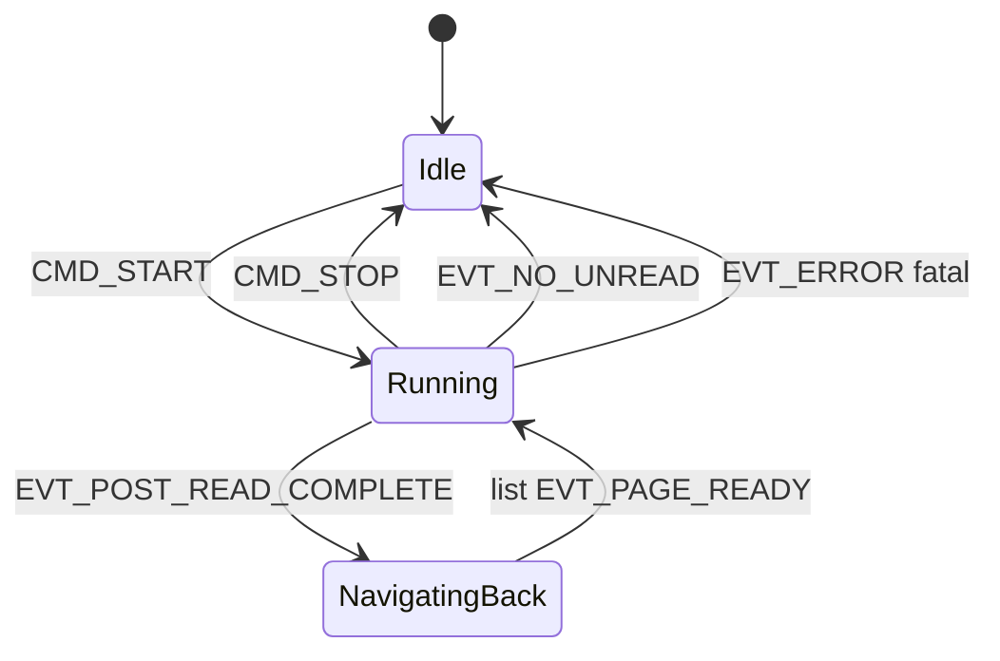

# LinuxDo Auto-Browser 技术架构计划

> 状态：**已批准**（架构设计阶段）  
> 依据：`specs/linuxdo_ext_spec.md`、`.cursor/rules/chrome_ext.mdc`、`AGENTS.md`

## 1. 项目目标

在 LinuxDo 论坛（Discourse）上模拟真实用户的自动浏览行为：识别未读帖子 → 拟人化阅读 → 返回列表继续循环。核心原则：**只读不写**，寄宿于用户真实浏览器环境，共享登录态与浏览器指纹。

## 2. 已确认的设计决策

| 决策点 | 选择 | 说明 |
|--------|------|------|
| 无未读时 | **自动停止** | Background 收到 `EVT_NO_UNREAD` 后等价执行 `CMD_STOP`，Popup 同步为 idle |
| 起始列表页 | **点开始时的当前 tab URL** | Popup 读取活动 tab URL 写入 `listUrl`，不固定 `/latest` |
| 公共工具 | **抽离 `utils.js`** | delay、logger、消息封装、abort 作用域统一复用 |
| 图标 | **无现成素材** | 首版使用极简占位 PNG（16/48/128），后续可替换 |

## 3. 总体架构



### 职责分工

| 模块 | 职责 |
|------|------|
| **Popup** | 开始/停止开关；校验当前 tab 为列表页；读取/展示运行状态 |
| **Background** | 中央调度器：持久状态、消息路由、标签页导航、自动停止 |
| **Content Script** | 列表模式扫描未读帖；详情模式拟人滚动；DOM 操作 |
| **utils.js** | 跨模块公共：延迟、日志、消息构造、abort 定时器管理 |

### 核心循环

1. Popup 发 `CMD_START` → Background 置 `isRunning=true`，记录 `listUrl`，清空 `visitedTopicIds`
2. Content（列表模式）筛选未读帖 → 随机延迟后点击进入
3. Content（详情模式）拟人滚动到底 → 发 `EVT_POST_READ_COMPLETE`
4. Background `tabs.update` 回到 `listUrl` → Content 重新扫描 → 重复
5. 无未读 → `EVT_NO_UNREAD` → 自动停止；用户点停止 → `CMD_STOP` → 立即停止所有 pending 操作

## 4. 目录结构

```
linuxdo-ext/
├── manifest.json                 # MV3 入口
├── popup/
│   ├── popup.html                # 开始 / 停止按钮
│   └── popup.js                  # 状态读写、列表页校验、发指令
├── scripts/
│   ├── utils.js                  # delay / logger / message / abortScope
│   ├── background.js             # 状态机 + 消息路由 + 导航
│   └── content.js                # 列表扫描 / 详情滚动
├── icons/                        # 占位图标 16 / 48 / 128
│   ├── icon16.png
│   ├── icon48.png
│   └── icon128.png
├── docs/
│   └── architecture_plan.md      # 本文件
├── specs/
│   └── linuxdo_ext_spec.md
├── .cursor/rules/
├── AGENTS.md
└── README.md
```

### manifest.json 要点

| 字段 | 值 |
|------|-----|
| `manifest_version` | `3` |
| `permissions` | `storage`, `tabs`（按需 `scripting`） |
| `host_permissions` | `https://linux.do/*` |
| `background.service_worker` | `scripts/background.js`（`importScripts('utils.js')`） |
| `content_scripts.js` | `["scripts/utils.js", "scripts/content.js"]`，`run_at: "document_idle"` |
| `action.default_popup` | `popup/popup.html` |

## 5. Message Schema

### 5.1 信封格式

```typescript
interface ExtensionMessage {
  source: "linuxdo-ext";
  version: 1;
  type: MessageType;
  payload: Record<string, unknown>;
  timestamp: number;
}
```

**Background 校验**：`source` 必须为 `linuxdo-ext`；content 来源须 `sender.tab.url` 以 `https://linux.do` 开头。

### 5.2 消息类型

| 方向 | `type` | `payload` | 说明 |
|------|--------|-----------|------|
| Popup → BG | `CMD_START` | `{ listUrl: string }` | Popup 从当前活动 tab 取 URL |
| Popup → BG | `CMD_STOP` | `{}` | 用户手动停止 |
| Popup → BG | `CMD_GET_STATUS` | `{}` | Popup 打开时同步状态 |
| BG → Content | `EVT_STATE_CHANGED` | `{ isRunning, listUrl }` | 启停广播；SW 唤醒后重发 |
| BG → Content | `CMD_ABORT` | `{ reason }` | 强制中止 pending 操作 |
| Content → BG | `EVT_PAGE_READY` | `{ pageMode: "list"\|"topic", url }` | 页面就绪，按模式启动 |
| Content → BG | `EVT_TOPIC_ENTERED` | `{ topicId, topicUrl }` | 点击前记录，防重复 |
| Content → BG | `EVT_POST_READ_COMPLETE` | `{ topicId, topicUrl }` | 滚到底，触发回列表 |
| Content → BG | `EVT_NO_UNREAD` | `{ listUrl, scannedCount }` | 触发自动停止 |
| Content → BG | `EVT_ERROR` | `{ code, message, pageMode }` | 异常上报，不静默崩溃 |
| BG → Popup | `EVT_RUN_FINISHED` | `{ reason, scannedCount? }` | 自动停止后通知 UI |

### 5.3 通信 API

- Content → BG：`chrome.runtime.sendMessage`
- BG → Content：`chrome.tabs.sendMessage`（try-catch，tab 无脚本时静默）
- Popup → BG：`chrome.runtime.sendMessage` + `sendResponse`（`CMD_GET_STATUS`）
- 不使用长连接 `chrome.runtime.connect`（SW 易被回收）

### 5.4 持久状态（chrome.storage.local）

```json
{
  "isRunning": false,
  "listUrl": "",
  "visitedTopicIds": [],
  "lastFinishedReason": null
}
```

- `visitedTopicIds`：`CMD_START` 时清空，运行中累积，防 DOM 未刷新重复点击
- `lastFinishedReason`：`"no_unread"` | `"user_stop"` | `"error"` | `null`

## 6. 避免已读帖与置顶帖

LinuxDo 基于 Discourse，实现前需在真实页面验证 selector。

### 6.1 页面模式

```javascript
// list: /latest, /, /c/, 分类页等（非 /t/ 详情）
// topic: /t/{slug}/{id}
// unknown: 个人页、设置页等 → 不操作
```

### 6.2 列表过滤管道（顺序执行，任一失败即排除）

| 步骤 | 条件 | 目的 |
|------|------|------|
| 1 | 含 `.topic-list-thumbtack` 或 class 含 `pinned` / `global-pin` | 排除置顶（优先级高于未读） |
| 2 | 不含 `unseen-topic` 且不含 `new-posts` | 排除已读 |
| 3 | 标题 `a.title` 非 bold（辅助） | 主题自定义 CSS 时的兜底 |
| 4 | `topicId` 在 `visitedTopicIds` 中 | 排除本轮已点 |
| 5 | href 匹配 `/t/{slug}/{id}` | 排除外链、广告 |
| 6 | 非公告/广告分类（如 `category-announcement`） | 排除广告帖 |

**选取策略**：通过过滤的候选中 **随机取 1 条**。

### 6.3 点击与双保险

- 对 `a.title` 或 `td.main-link a` 执行单次 `element.click()`
- 点击前 `randomDelay(3000, 8000)` ms
- 不用 `window.location.href` 硬跳转
- 进入详情后若 DOM 异常 → `history.back()` + `EVT_ERROR`，不滚动

### 6.4 无未读与空 DOM

- `scannedCount > 0` 且候选为 0 → `EVT_NO_UNREAD` → 自动停止
- `scannedCount === 0`（DOM 未就绪）→ 延迟重试最多 3 次，仍失败 → `EVT_ERROR` + 自动停止

## 7. 详情页拟人滚动

| 参数 | 值 |
|------|-----|
| 单步滚动 | `random(300, 800)` px，`behavior: "smooth"` |
| 步间停顿 | `randomDelay(3000, 8000)` ms |
| 到底判定 | `innerHeight + scrollY >= scrollHeight - 50` |
| 长帖懒加载 | 连续 3 次到底后 `scrollHeight` 仍增长则继续滚 |
| 完成信号 | 稳定到底 + 末段 `randomDelay` → `EVT_POST_READ_COMPLETE` |

**停止**：`abortScope.abort()` 清除全部 timer；滚动循环每步检查 `isRunning`。

## 8. utils.js 规划

| 导出 | 用途 |
|------|------|
| `LOG_PREFIX` / `log` / `logError` | 统一 `[LinuxDo-Bot]` 前缀日志 |
| `randomInt(min, max)` | 含端点随机整数 |
| `randomDelay(minMs, maxMs)` | 默认 3000–8000 ms Promise |
| `createAbortScope()` | `{ schedule(fn, ms), abort() }` 定时器登记与一键清除 |
| `makeMessage(type, payload)` | 构造标准 Envelope |
| `isLinuxDoUrl` / `isListPage` / `isTopicPage` | URL 判定 |

约束：零依赖、无 `eval`、业务逻辑禁止裸 `setTimeout`。

## 9. Background 状态机



- `EVT_POST_READ_COMPLETE`：仅 `tabs.update(tabId, { url: listUrl })`，不用 `history.back()`
- SW 唤醒：`onStartup` / `onInstalled` 从 storage 恢复，向 linux.do tab 重发 `EVT_STATE_CHANGED`

## 10. Popup 交互

| 状态 | 开始 | 停止 |
|------|------|------|
| Idle | 可点 | 禁用 |
| Running | 禁用 | 可点 |

**点开始前置校验**：

1. 当前 tab 为 `https://linux.do` 且为列表页（非 `/t/` 详情）
2. 不合法 → 提示「请在帖子列表页点击开始」，不发消息

## 11. 图标占位方案

首版无设计资源：生成极简占位 PNG（纯色底 + 字母 `L`），16/48/128 三尺寸，满足 Chrome 加载无警告。后续直接替换 `icons/` 下文件即可。

## 12. 实现顺序

1. `scripts/utils.js`
2. `manifest.json` + `icons/` 占位图
3. `popup/`（开始/停止 + 列表页校验）
4. `background.js`（状态机 + 消息路由 + 自动停止）
5. `content.js`（列表日志 → 点击 → 滚动 → 闭环）

每步完成后本地 `chrome://extensions/` 加载验证，再进下一步。

## 13. 主要风险与对策

| 优先级 | 风险 | 对策 |
|--------|------|------|
| 1 | MV3 SW 随时被回收 | 状态写 `chrome.storage.local`；`tabs.onUpdated` 作回环兜底；消息幂等 |
| 2 | Discourse DOM / 主题差异 | selector 集中常量；class + bold 双重判定；实现日 DOM 快照验证 |
| 3 | 停止后 timer 仍触发 | `utils.js` 的 `abortScope`；每步检查 `isRunning` |
| 4 | 回错列表页 | start 时快照 URL；禁止 `history.back()` |
| 5 | 空 DOM 误判无未读 | 重试 3 次后再报错停止 |
| 6 | 长帖懒加载 | 稳定到底检测 + 末段额外延迟 |
| 7 | 反自动化体感 | 随机选帖/延迟/步长；无未读自动停止，避免空转 |

## 14. 红线（NEVER）

- 不引入 React/Vue/Webpack 等构建工具
- 不处理登录与密码
- 不执行发帖、回复、点赞等写操作
- DOM 操作间必须穿插 `randomDelay(3000, 8000)`，禁止连续瞬间操作
- 通信使用 `chrome.runtime.sendMessage`，不用 `eval`

## 15. 运行时统计 HUD

详情页拟人滚动期间，在页面右下角展示只读浮动面板（`pointer-events: none`），停止 / 读完 / 离开主题时移除。

| 行 | 内容 | 数据来源 |
|----|------|----------|
| 今日 | `N/上限 帖 · 新读 M 楼` | `dailyStats` 进帖时快照 |
| 本主题 | `已读/总数 · 本次+K` | `.read-state` 实时扫描 + Discourse 进度条/预加载总分母 |

- **已读**：当前带 `.read-state.read` 的楼层（含进入时已读）
- **本次+K**：本帖内未读→已读，写入 `EVT_POST_READ_COMPLETE.newlyReadReplies`
- **总数**：解析失败显示 `?`；同帖内取观察到的最大值（懒加载分母可变大）
